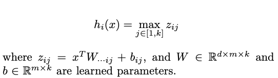

# maxout
PyTorch implementation of the "Maxout unit/activation" described in the paper "Maxout Networks".

## The Maxout Unit
Maxout units devide the input $x \in \mathbb{R}^d$ into groups of $k \in \mathbb{N}$ values. Each maxout unit then outputs the maximum element of one of these groups:



## Usage

```python
from maxout.maxout import Maxout


x = torch.rand(64, 5)   # shape [64, 5] (N=64 samples)

# creating a maxout layer with 5 input and 3 output neurons
maxout = Maxout(in_features=5, out_features=3, k_groups = 7)

out = maxout(x)         # shape [64, 3]
```

## Experiments (replicated)

Original


Replication

