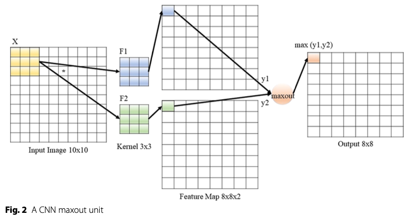

# maxout
PyTorch implementation of the "Maxout unit" described in the paper [Maxout Networks](https://arxiv.org/abs/1302.4389).

## The Maxout Unit
Maxout units devide the input $x \in \mathbb{R}^d, d\in \mathbb{N}$ into groups of $k \in \mathbb{N}$ values. Each maxout unit then outputs the maximum element of one of these groups:


Taken from *Ian J. Goodfellow at al., 2013*,
"Max Networks",
*Proceedings of Machine Learning Research*, 2013


## Usage

### Fully Connected Maxout-layer:
```python
import torch
from maxout.maxout import Maxout

# input shape: [64, 5]
input = torch.rand(64, 5)

# maxout hidden layer with 240 units and 5 pieces
maxout = Maxout(in_features=5, num_units=240, num_pieces= 5)

# output shape: [64, 240]
output = maxout(input)
```

### Convolutional Maxout-layer:

```python
import torch
from maxout.maxout_conv2d import MaxoutConv2d


# input shape: [64, 3, 32, 32]
input = torch.rand(64, 3, 32, 32)

# convolutional maxout layer with 96 channels and 2 pieces
maxout_conv2d = MaxoutConv2d(
  in_channels=3,
  out_channels=96,
  num_pieces=2,
  kernel_size=8,
)

# output shape: [64, 96, 25, 25]
output = maxout_conv2d(input)
```
## Visualization of Maxout layers


*Maxout layer with 2 maxout units and 2 pieces; Taken from Gabriel Castaneda at al., 2019*


*Convolutional maxout layer with 1 output channel and 2 pieces; Taken from Gabriel Castaneda at al., 2019*

```bibtex
@InProceedings{pmlr-v28-goodfellow13,
  title = 	 {Maxout Networks},
  author = 	 {Goodfellow, Ian and Warde-Farley, David and Mirza, Mehdi and Courville, Aaron and Bengio, Yoshua},
  booktitle = 	 {Proceedings of the 30th International Conference on Machine Learning},
  pages = 	 {1319--1327},
  year = 	 {2013},
  editor = 	 {Dasgupta, Sanjoy and McAllester, David},
  volume = 	 {28},
  number =       {3},
  series = 	 {Proceedings of Machine Learning Research},
  address = 	 {Atlanta, Georgia, USA},
  month = 	 {17--19 Jun},
  publisher =    {PMLR},
  pdf = 	 {http://proceedings.mlr.press/v28/goodfellow13.pdf},
  url = 	 {https://proceedings.mlr.press/v28/goodfellow13.html},
}
```